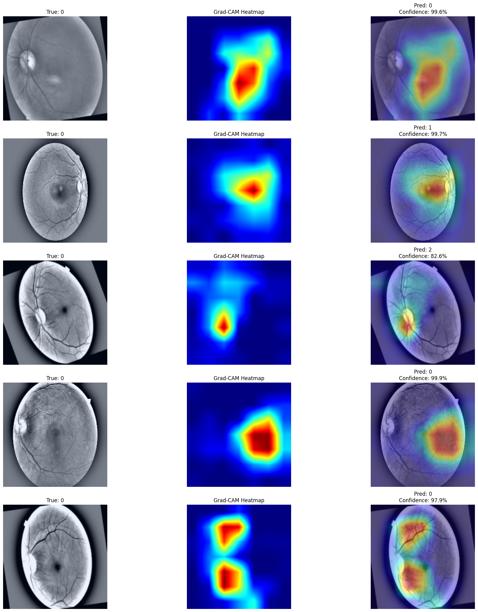
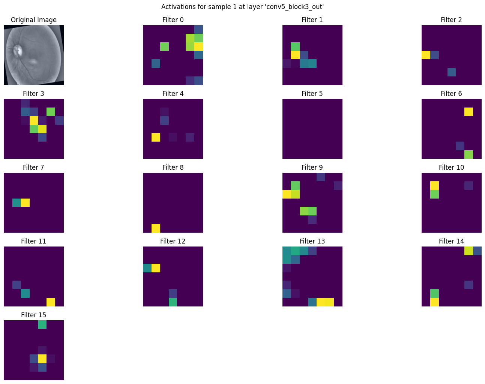
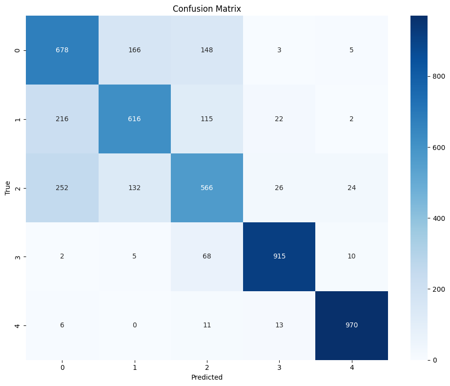
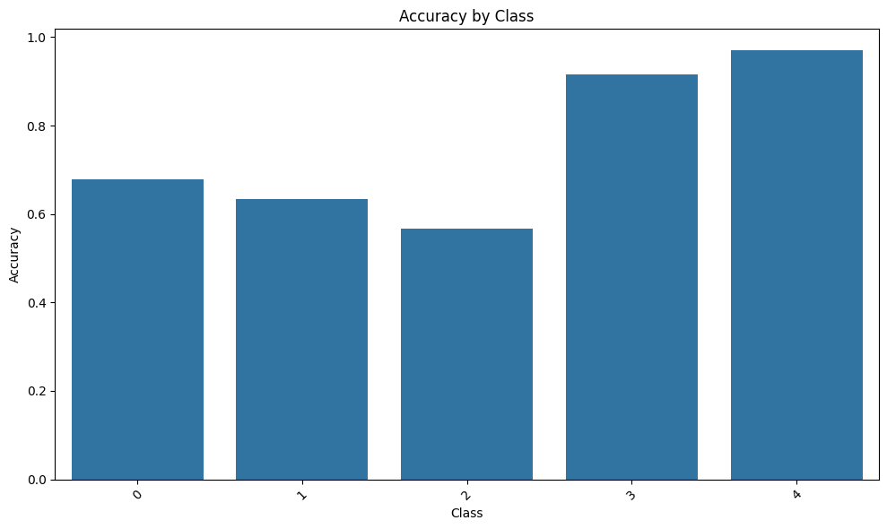
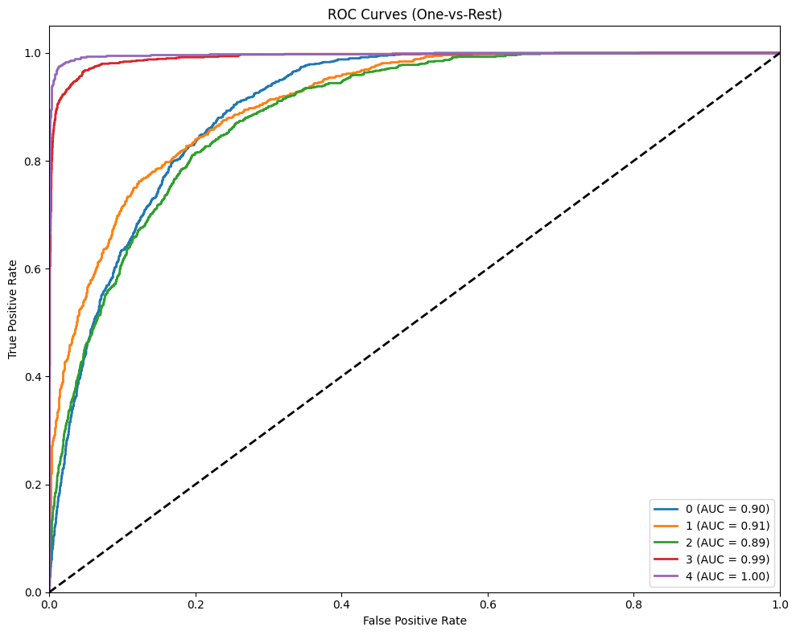
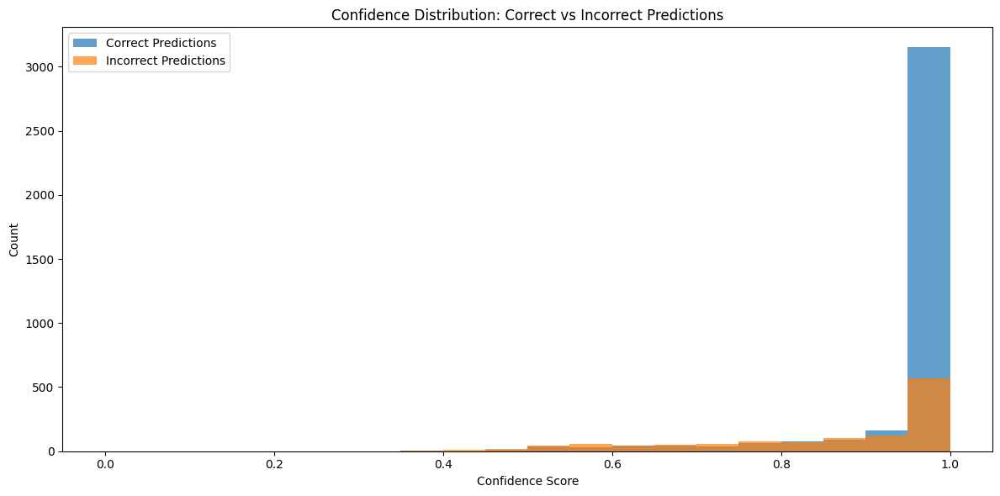

# diabetic-retinopathy-classifier

A deep learning-based solution that classifies diabetic retinopathy severity levels from retinal images using a hybrid CNN-Transformer architecture.

This project implements a hybrid image classification model combining ResNet50 (CNN) and a custom Vision Transformer (ViT) feature extractor. It leverages TensorFlow and Keras to build and train the model, and includes comprehensive evaluation and explanation.

## Table of Contents

- [diabetic-retinopathy-classifier](#diabetic-retinopathy-classifier)
  - [Table of Contents](#table-of-contents)
  - [Project Structure](#project-structure)
  - [Model Architecture](#model-architecture)
  - [Dataset](#dataset)
  - [Requirements](#requirements)
  - [Installation](#installation)
  - [Usage](#usage)
  - [Evaluation Results](#evaluation-results)
    - [Classification Report](#classification-report)
    - [Detailed Class Performance Analysis](#detailed-class-performance-analysis)
  - [Explanation](#explanation)
    - [Grad-CAM Explanation](#grad-cam-explanation)
    - [Layer Activations](#layer-activations)
  - [Analysis and visualizations](#analysis-and-visualizations)
    - [Confusion Matrix](#confusion-matrix)
    - [Accuracy by Class](#accuracy-by-class)
    - [ROC Curves](#roc-curves)
    - [Confidence Distribution](#confidence-distribution)

## Project Structure

```markdown
.
├── data
├── dataset
│   ├── test
│   ├── train
│   └── val
├── models
├── notebook
├── utils
├── .github
│   └── assets
├── main.py
└── requirements.txt

```

- `dataset/`: Contains the training (already augmented), validation, and test datasets
- `models/`: Contains the model definitions (ResNet, ViT, and the hybrid model).
- `utils/`: Contains utility functions for training, evaluation, explanation, and analysis.
- `notebook/`: Contains the original Jupyter Notebook for use on colab.
- `.github/assets`: Contains images for this README.
- `main.py`: Main script to run the model training and evaluation.
- `requirements.txt`: List of Python dependencies.

## Model Architecture

The hybrid model combines ResNet50 and a custom ViT feature extractor:

- **ResNet50 Branch**: Uses a pre-trained ResNet50 model (excluding the top layer) for CNN feature extraction.
- **ViT Branch**: Implements a custom ViT feature extractor layer with learnable patch embeddings, class token, position embeddings, and transformer blocks.
- **Concatenation**: Concatenates the features from both branches and passes them through dense layers for final classification.

## Dataset

The dataset is organized into `train`, `val`, and `test` directories, each containing subdirectories for each class. Images are resized to 224x224 pixels.

## Requirements

- Python 3.10+
- TensorFlow 2.x
- scikit-learn
- matplotlib
- seaborn
- opencv-python
- tf-keras-vis

Install dependencies using:

```bash
pip install -r requirements.txt
````

## Installation

1. Clone the repository:

    ```bash
    git clone git@github.com:Arqamz/diabetic-retinopathy-classifier.git
    cd diabetic-retinopathy-classifier
    ```

2. Install the required packages:

    ```bash
    pip install -r requirements.txt
    ```

## Usage

1. **Prepare the dataset**: Import the [dataset - kushagratandon12/diabetic-retinopathy-balanced](https://www.kaggle.com/datasets/kushagratandon12/diabetic-retinopathy-balanced/data) into the dataset directory and make sure the train, val and test directories are at the root of the dataset directory.

2. **Run the main script**:

    ```bash
    python main.py
    ```

    This will:

      - Load and preprocess the dataset.
      - Build and train the hybrid model.
      - Evaluate the model.
      - Generate Grad-CAM explanations.
      - Perform detailed performance analysis.
      - Visualize layer activations.

## Evaluation Results

### Classification Report

| Class | Precision | Recall | F1-score | Support |
|-------|-----------|--------|----------|---------|
| 0     | 0.59      | 0.68   | 0.63     | 1000    |
| 1     | 0.67      | 0.63   | 0.65     | 971     |
| 2     | 0.62      | 0.57   | 0.59     | 1000    |
| 3     | 0.93      | 0.92   | 0.92     | 1000    |
| 4     | 0.96      | 0.97   | 0.96     | 1000    |
| **Accuracy** |   |   | **0.75** | **4971** |
| **Macro avg** | 0.76      | 0.75   | 0.75     | 4971    |
| **Weighted avg** | 0.76   | 0.75   | 0.75     | 4971    |

### Detailed Class Performance Analysis

| Class | Accuracy | Samples | Most Common Error | Error % | Avg Conf | Min Conf | Max Conf |
|-------|----------|---------|-------------------|---------|----------|----------|----------|
| 0     | 0.68     | 1000    | 1                 | 0.17    | 0.94     | 0.40     | 1.00     |
| 1     | 0.63     | 971     | 0                 | 0.22    | 0.94     | 0.49     | 1.00     |
| 2     | 0.57     | 1000    | 0                 | 0.25    | 0.93     | 0.36     | 1.00     |
| 3     | 0.92     | 1000    | 2                 | 0.07    | 0.99     | 0.40     | 1.00     |
| 4     | 0.97     | 1000    | 3                 | 0.01    | 0.99     | 0.36     | 1.00     |

## Explanation

### Grad-CAM Explanation



### Layer Activations



## Analysis and visualizations

### Confusion Matrix



### Accuracy by Class



### ROC Curves



### Confidence Distribution


